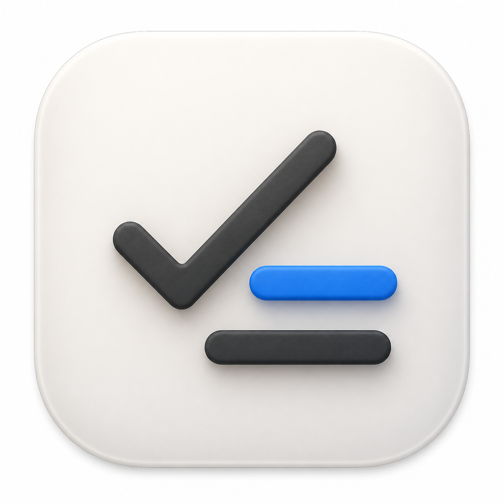

<p align="center">
  
</p>

<h1 align="center">Today</h1>

<p align="center">
  Минималистичный список дел в строке меню macOS.<br>
  Быстро открывается, не требует аккаунта и хранит данные только на вашем Mac.
</p>

## Возможности

- открытие списка при наведении на значок в строке меню;
- закрепление окна обычным кликом;
- системное меню с завершением приложения по правому клику;
- добавление, редактирование, выполнение и удаление дел без отдельного окна;
- многострочные задачи: `Enter` создаёт новый абзац, `⌘ + Enter` сохраняет;
- системные команды копирования, вставки, вырезания и выделения текста;
- полный текст задач без обрезки;
- автоматический перенос незавершённых дел на следующий день;
- сворачиваемый список выполненных дел за сегодня;
- история выполненных дел с группировкой по датам;
- современная скруглённая панель в стиле macOS, ChatGPT и Notion;
- увеличенная типографика и вкладки, равномерно занимающие доступную ширину;
- светлая и тёмная темы с нейтральными фонами;
- полностью локальная работа без сервера, аналитики и регистрации.

## Совместимость

Готовая сборка является Universal Binary и работает на:

- Mac с Apple Silicon (`arm64`);
- Mac с процессором Intel (`x86_64`);
- macOS 13 Ventura или новее.

## Установка

1. Откройте страницу [последнего релиза](https://github.com/IwanBelenko/TodayBar/releases/latest).
2. Скачайте `Today-1.3.1-universal.zip`.
3. Распакуйте архив и переместите `Today.app` в папку «Программы».
4. При первом запуске нажмите на приложение правой кнопкой и выберите «Открыть».

Приложение подписано локальной подписью. Поэтому macOS может запросить дополнительное подтверждение при первом запуске вне Mac App Store.

## Автозапуск

Чтобы Today запускался вместе с Mac:

1. Откройте «Системные настройки».
2. Перейдите в «Основные → Объекты входа».
3. Нажмите `+` и выберите `Today.app` из папки «Программы».

## Управление

| Действие | Результат |
| --- | --- |
| Навести курсор на значок | Быстро показать список |
| Нажать левой кнопкой | Закрепить или закрыть окно |
| Нажать правой кнопкой | Открыть меню приложения |
| Нажать «Сегодня» или «История» | Переключить раздел на всей ширине вкладки |
| `⌘C` / `⌘V` / `⌘X` | Копировать, вставить или вырезать текст |
| Правый клик по выполненной задаче | Скопировать задачу целиком |
| `Enter` при вводе | Добавить новый абзац |
| `⌘ + Enter` | Сохранить новую задачу |
| Нажать на чекбокс | Выполнить или вернуть задачу |

## Где хранятся данные

Все задачи сохраняются локально:

```text
~/Library/Application Support/TodayBar/tasks.json
```

Удаление приложения не удаляет этот файл автоматически. Благодаря этому список можно сохранить при переустановке. Для переноса на другой Mac скопируйте `tasks.json` в такую же папку нового компьютера при закрытом Today.

## Сборка из исходного кода

Для сборки нужен Mac с актуальными Xcode Command Line Tools или Xcode.

```bash
git clone https://github.com/IwanBelenko/TodayBar.git
cd TodayBar
./scripts/build-app.sh
```

Готовое приложение появится в:

```text
dist/Today.app
```

Скрипт собирает единое приложение для Intel и Apple Silicon и подписывает его локальной ad-hoc подписью.

## Архитектура

Проект разделён на независимые слои:

```text
AppSources/TodayBar
├── App             # жизненный цикл и интеграция со строкой меню
├── Data            # локальное JSON-хранилище
├── Domain          # модель задачи
└── Presentation    # SwiftUI-интерфейс и состояние экрана
```

Такое разделение позволяет позже добавить синхронизацию, напоминания или другое хранилище без переписывания интерфейса.

## Конфиденциальность

Today не использует сеть, не отправляет аналитику и не требует разрешений на доступ к календарю, контактам или файлам пользователя. Данные остаются на Mac.
